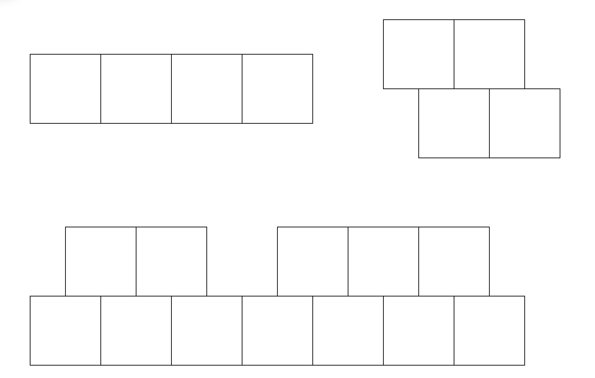

# 고양이 건반 연주 웹앱 제품·기능 명세서

- 문서 버전: v1.0
- 문서 상태: 구현 범위 확정
- 작성일: 2026-08-01
- 배포 대상: Cloudflare Pages 정적 사이트
- 지원 환경: Windows, macOS, Android, iOS의 주요 최신 브라우저

## 1. 제품 개요

화면의 가상 건반 또는 컴퓨터 키보드로 피아노를 연주하고, 옥타브와 조성을 즉시 바꿀 수 있는 정적 웹앱을 만든다. 터치, 멀티터치, 마우스, 컴퓨터 키보드 입력을 지원한다.

화면 중앙에는 연주 상태에 반응하는 긴 고양이 캐릭터를 배치한다. 고양이는 음이 나는 동안 입을 벌리고, 연주한 건반의 음에 따라 몸통 길이가 12단계로 변한다. 음색을 변경하면 음원과 고양이·발바닥 이미지를 함께 교체할 수 있도록 에셋 구조를 데이터 중심으로 구성한다.

## 2. 핵심 원칙

1. 한 화면 안에서 옥타브, 전조, 연주 상태를 확인하고 바로 조작할 수 있어야 한다.
2. 화면 방향과 기기 종류가 달라도 동일한 가로형 레이아웃을 유지한다.
3. 연주 입력부터 소리가 날 때까지의 지연을 최소화한다.
4. 어떤 입력이 취소되더라도 소리가 계속 남는 현상이 없어야 한다.
5. 음원과 캐릭터 이미지는 코드 수정 없이 설정 데이터로 교체할 수 있어야 한다.
6. 마이크 입력은 음량 측정에만 사용하며 음높이 분석과 FFT를 사용하지 않는다.

## 3. 참고 레이아웃 및 이미지

### 3.1 초기 레이아웃



### 3.2 기본 캐릭터 에셋

| 용도 | 기본 파일 |
| --- | --- |
| 짧은 몸통과 꼬리 | `../imgs/vector/bodyend.svg` |
| 반복 몸통 | `../imgs/vector/bodymiddle.svg` |
| 닫힌 입과 앞 몸통 | `../imgs/vector/mouthclose.svg` |
| 열린 입과 앞 몸통 | `../imgs/vector/mouthopen.svg` |
| 건반 발바닥 | `../imgs/vector/pawpad1.svg` |

기본 고양이 SVG는 현재 방향에서 좌우 반전해 사용한다. 반전 후 꼬리는 왼쪽, 머리는 오른쪽에 위치한다.

## 4. 화면 구조

```text
┌────────────────────────────────────────────────────────────────────┐
│ [O2][O3][O4][O5]                       [반음↓][반음↑]             │
│ 왼쪽 옥타브 선택                        [5도↓ ][5도↑ ]             │
│                                                                    │
│                 꼬리 ── 반복 몸통 ── 고양이 머리                  │
│                                                                    │
│ [낮은 B][ C ][C♯][ D ][D♯][ E ][ F ][F♯][ G ][G♯][ A ][A♯][ B ][C]│
└────────────────────────────────────────────────────────────────────┘
```

두 옥타브 표시 설정을 켜면 아래와 같이 구성한다.

```text
┌────────────────────────────────────────────────────────────────────┐
│ [왼쪽 옥타브 선택 4개]      [오른쪽 옥타브 선택 4개] [전조 컨트롤]│
│                                                                    │
│                 꼬리 ── 반복 몸통 ── 고양이 머리                  │
│                                                                    │
│ [왼쪽 건반 한 세트]                         [오른쪽 건반 한 세트] │
└────────────────────────────────────────────────────────────────────┘
```

### 4.1 화면 방향

- 앱은 항상 가로형 화면 구성을 사용한다.
- 세로 화면을 위한 별도의 재배치, 세로 전용 컴포넌트, 세로형 건반 배열을 만들지 않는다.
- 세로 방향의 기기에서도 동일한 가로형 스테이지 전체를 비율에 맞춰 표시한다.
- 상단 컨트롤, 고양이, 건반의 상대적 위치와 순서는 화면 방향에 따라 바뀌지 않는다.

### 4.2 레이어 순서

1. 상단: 옥타브 선택 및 전조 컨트롤
2. 중앙: 음에 반응하는 고양이
3. 하단: 건반
4. 최상단 오버레이: 설정 패널, 권한 안내, 오류 메시지

## 5. 건반 구성

### 5.1 한 세트의 기본 구성

한 건반 세트는 아래 음을 표시한다.

```text
낮은 B + C, C♯, D, D♯, E, F, F♯, G, G♯, A, A♯, B + 높은 C
```

- 흰 건반: 9개
- 검은 건반: 5개
- 낮은 B와 높은 C는 기본적으로 모두 표시한다.
- 설정에서 낮은 B와 높은 C를 각각 숨길 수 있다.
- 화면에서 숨겨진 건반도 컴퓨터 키보드 매핑을 통한 연주는 계속 가능하다.

### 5.2 한 옥타브와 두 옥타브 표시

- 기본 화면은 건반 한 세트를 표시한다.
- 설정에서 `건반 한 세트 추가`를 켜면 왼쪽과 오른쪽에 두 세트를 표시한다.
- 두 세트는 각각 독립적인 옥타브를 선택할 수 있다.
- 왼쪽 세트의 기본 선택값은 `O2`, 오른쪽 세트의 기본 선택값은 `O3`이다.
- 한 세트만 표시할 때는 왼쪽 세트의 설정과 입력 매핑을 사용한다.

### 5.3 옥타브 프리셋

- 한 세트당 같은 크기의 옥타브 선택 버튼 4개를 제공한다.
- 기본 프리셋 값은 `O2 / O3 / O4 / O5`이다.
- 설정에서 네 버튼의 값을 각각 독립적으로 바꿀 수 있다.
- 예: `O1 / O4 / O5 / O6`처럼 연속되지 않는 조합도 허용한다.
- 설정 가능한 값의 범위는 `O0–O8`이다.
- 두 건반 세트를 표시할 때 프리셋 구성은 공유하지만, 현재 선택은 왼쪽과 오른쪽이 서로 독립적이다.
- 선택된 버튼은 색상과 형태를 함께 사용해 분명하게 구분한다.
- 옥타브를 바꾸기 전에 시작된 음은 시작 당시의 음높이로 정확히 종료한다.

## 6. 전조 컨트롤

오른쪽 상단에 2×2 형태의 전조 버튼을 배치한다.

| 위치 | 기능 | 내부 변화량 |
| --- | --- | --- |
| 위 왼쪽 | 반음 내림 | `-1 semitone` |
| 위 오른쪽 | 반음 올림 | `+1 semitone` |
| 아래 왼쪽 | 5도 내림 | `-7 semitones` |
| 아래 오른쪽 | 5도 올림 | `+7 semitones` |

- 전조는 모든 건반 세트에 동시에 적용한다.
- 전조값은 실제 출력 음높이에 적용한다.
- 전조 범위에는 소프트웨어상 제한을 두지 않는다.
- 기기와 오디오 엔진이 표현할 수 있는 범위 안에서 주파수 또는 재생 속도를 계속 배수로 변경한다.
- 5도 버튼을 반복하면 실제 출력 음도 매번 완전5도씩 계속 올라가거나 내려간다.
- 옥타브 프리셋의 `O0–O8` 제한은 전조 결과에 적용하지 않는다.
- 현재 조성 이름을 전조 컨트롤 가까이에 표시한다.
- 화면에 표시하는 조성 이름은 누적 전조값을 12음으로 환산한다.
- 샵 또는 플랫 표기는 설정에서 사용자가 선택한다.
- 현재 전조 상태는 페이지를 다시 열 때 `C`, 전조값 `0`으로 초기화한다.

## 7. 음 이름 및 입력 라벨 표시

### 7.1 음 이름 표시 모드

설정에서 다음 세 가지 중 하나를 선택한다.

1. 음 이름을 표시하지 않음
2. 건반의 기본 음 이름 표시
3. 전조가 적용된 실제 출력 음 이름 표시

음 이름 표기는 샵 우선 또는 플랫 우선 설정을 따른다.

### 7.2 키 매핑 라벨

- 설정에서 건반 위에 컴퓨터 키보드 매핑 문자를 표시하거나 숨길 수 있다.
- 음 이름과 키 매핑 문자는 서로 독립적으로 표시할 수 있다.
- 낮은 B와 높은 C를 화면에서 숨겨도 해당 입력 매핑은 유지된다.

## 8. 입력 방식

### 8.1 터치와 멀티터치

- 동시에 여러 손가락으로 서로 다른 건반을 누를 수 있어야 한다.
- 각 손가락의 시작 건반과 실제 출력 음을 독립적으로 추적한다.
- 손가락을 누른 채 다른 건반으로 이동하면 이전 음을 종료하고 새 음을 시작하는 글리산도를 지원한다.
- 손가락이 건반 영역이나 화면 밖으로 나가거나 입력이 취소되면 해당 음을 반드시 종료한다.
- 건반 영역에서는 브라우저의 스크롤과 확대 제스처가 연주를 방해하지 않도록 한다.

### 8.2 마우스

- 클릭하고 누르는 동안 음이 나고 버튼을 놓으면 음을 종료한다.
- 누른 상태로 건반 사이를 이동하는 글리산도를 지원한다.
- 포인터가 창 밖으로 나가거나 포커스를 잃으면 관련 음을 종료한다.

### 8.3 컴퓨터 키보드

기본 매핑은 다음과 같다.

| 음 위치 | 낮은 B | C | C♯ | D | D♯ | E | F | F♯ | G | G♯ | A | A♯ | B | 높은 C |
| --- | --- | --- | --- | --- | --- | --- | --- | --- | --- | --- | --- | --- | --- | --- |
| 왼쪽 세트 | `1` | `Q` | `2` | `W` | `3` | `E` | `R` | `5` | `T` | `6` | `Y` | `7` | `U` | `I` |
| 오른쪽 세트 | `X` | `C` | `F` | `V` | `G` | `B` | `N` | `J` | `M` | `K` | `,` | `L` | `.` | `/` |

- 모든 음의 키 매핑은 설정에서 개별 변경할 수 있다.
- 같은 키를 여러 음에 중복 지정하지 못하도록 충돌을 안내한다.
- 운영체제의 키 반복으로 같은 음이 중복 시작되지 않도록 최초 `keydown`만 처리한다.
- 텍스트 입력 중에는 연주 단축키가 동작하지 않는다.
- 키를 놓거나 창이 포커스를 잃으면 대응하는 음을 종료한다.
- 한 세트만 표시하는 경우 왼쪽 매핑을 기본으로 사용한다.

### 8.4 서스테인

- 컴퓨터 키보드의 스페이스바를 누르고 있는 동안 서스테인이 작동한다.
- 스페이스바를 놓으면 손을 뗀 음의 서스테인을 종료한다.
- 모바일 기기의 하드웨어 볼륨 버튼은 웹 브라우저에서 안정적으로 매핑할 수 없으므로 사용하지 않는다.
- 별도의 화면용 서스테인 버튼은 제공하지 않는다.

### 8.5 MIDI

외부 MIDI 건반 입력은 제품 범위에 포함하지 않는다.

## 9. 오디오 동작

### 9.1 기본 재생

- 사용자가 제공하는 음원 파일을 편집해 음색 팩에 등록한다.
- 음원 앞뒤의 불필요한 무음과 클릭 노이즈를 제거하고 적절한 음량으로 정규화한다.
- 기준 음과 목표 음의 반음 차이에 따라 재생 속도 또는 주파수를 조정한다.
- 한 개의 기준 샘플을 사용할 때의 기본 계산식은 다음과 같다.

```text
playbackRate = 2 ^ (semitoneDifference / 12)
```

- 여러 기준 샘플이 제공되면 목표 음과 가장 가까운 샘플을 선택해 과도한 속도 변화를 줄일 수 있다.
- 음 시작과 종료에 짧은 페이드를 적용해 클릭 노이즈를 방지한다.
- 여러 음을 동시에 재생할 수 있어야 한다.
- 전체 음량 설정을 최종 출력 게인에 적용한다.

### 9.2 음색 변경

- 설정에서 등록된 음색을 선택할 수 있다.
- 음색을 변경하면 음원과 연결된 캐릭터·발바닥 테마도 함께 변경한다.
- 변경 과정에서 기존 연주 음이 남지 않도록 재생 중인 음을 안전하게 종료한다.
- 음색 에셋 일부가 없으면 기본 고양이 테마의 해당 이미지를 사용한다.

## 10. 불어서 연주

### 10.1 기본 상태와 권한

- 불어서 연주 기능은 기본적으로 꺼져 있다.
- 사용자가 설정에서 기능을 켤 때만 마이크 권한을 요청한다.
- 마이크 권한이 없거나 거절된 경우 일반 연주 모드는 계속 사용할 수 있다.
- 마이크는 서버로 전송하거나 녹음하지 않고 브라우저 안에서만 처리한다.

### 10.2 음량 계산

- 마이크 입력은 바람의 세기에 따른 전체 연주 음량만 제어한다.
- 마이크를 이용한 음높이 분석은 하지 않는다.
- FFT, 주파수 스펙트럼 분석, 피치 추적을 사용하지 않는다.
- 시간영역 샘플의 RMS 또는 이에 준하는 가벼운 진폭 계산만 사용한다.
- 설정에서 다음 값을 조절할 수 있다.
  - 마이크 감도
  - 바람으로 판단할 최소 입력 세기
- 최소 입력 세기보다 작으면 모든 연주 음을 음소거한다.
- 임계값을 넘으면 바람 세기를 0–1 범위로 정규화해 음량에 반영한다.
- 최종 음량은 다음 원칙을 따른다.

```text
일반 모드 음량 = 전체 음량 × 음별 엔벌로프
불어서 연주 음량 = 전체 음량 × 바람 세기 × 음별 엔벌로프
```

- 값이 떨리는 현상을 줄이기 위해 가벼운 스무딩을 적용하되 연주 반응이 늦어지지 않도록 한다.

## 11. 고양이 애니메이션

### 11.1 배치와 방향

- 고양이는 상단 컨트롤과 하단 건반 사이에 배치한다.
- 기본 SVG를 좌우 반전해 꼬리를 왼쪽, 머리를 오른쪽에 둔다.
- 꼬리와 뒷부분은 왼쪽 기준점에 고정한다.
- 몸통이 길어지면 반복 몸통을 가운데 삽입하고 머리와 앞부분이 오른쪽으로 이동한다.
- 12단계의 길이가 모두 화면 안에서 구분되도록 몸통 조각 크기와 고양이 영역을 설계한다.

### 11.2 초기 및 정지 상태

- 앱을 처음 열면 가장 짧은 몸통과 닫힌 입을 표시한다.
- 연주를 시작하면 해당 건반에 맞는 길이로 변경한다.
- 실제로 음이 들리는 동안 입을 연다.
- 모든 음이 끝나면 몸통은 마지막으로 연주한 음의 길이를 유지하고 입만 닫는다.
- 새로고침하면 다시 가장 짧고 입을 닫은 초기 상태로 돌아간다.

### 11.3 길이 결정 규칙

고양이 길이는 실제 전조된 음이 아니라 누른 건반의 원래 위치를 기준으로 한다.

- 옥타브 번호는 고양이 길이에 영향을 주지 않는다.
- `O3 G`와 `O4 G`는 같은 길이다.
- 전조 때문에 C 건반이 D 음을 내더라도 C에 해당하는 길이를 사용한다.
- 동시에 여러 음이 들리면 전조 전 기준 음높이가 가장 높은 건반을 대표 음으로 사용한다.
- 서스테인 중인 음도 현재 들리는 음에 포함한다.

12개 음의 몸통 단계는 다음과 같다.

| 건반 음 | 반복 몸통 개수 | 길이 |
| --- | ---: | --- |
| B | 0 | 가장 짧음 |
| A♯/B♭ | 1 | 2단계 |
| A | 2 | 3단계 |
| G♯/A♭ | 3 | 4단계 |
| G | 4 | 5단계 |
| F♯/G♭ | 5 | 6단계 |
| F | 6 | 7단계 |
| E | 7 | 8단계 |
| D♯/E♭ | 8 | 9단계 |
| D | 9 | 10단계 |
| C♯/D♭ | 10 | 11단계 |
| C | 11 | 가장 김 |

낮은 B는 B와 같은 길이, 높은 C는 C와 같은 길이를 사용한다.

### 11.4 입 열림 규칙

- 일반 모드에서는 음이 하나라도 실제 출력 중이면 입을 연다.
- 서스테인으로 유지되는 음도 출력 중인 음으로 취급한다.
- 불어서 연주 모드에서는 건반을 누른 것만으로 입을 열지 않는다.
- 바람 입력이 최소 세기를 넘어 실제로 소리가 들리는 동안만 입을 연다.
- 음이 모두 끝나거나 바람이 임계값 아래로 내려가면 입을 닫는다.

## 12. 발바닥 건반 표시

- 모든 표시 중인 건반에 발바닥 이미지를 배치한다.
- 흰 건반과 검은 건반에서 모두 식별되도록 음색 테마가 색상 또는 별도 에셋을 지정할 수 있다.
- 건반을 누르면 발바닥의 색상, 크기 또는 투명도를 바꿔 입력 상태를 표시한다.
- 눌림 효과는 레이아웃 크기를 변경하지 않는 방식으로 구현한다.
- 음색별 발바닥 이미지가 없으면 기본 `pawpad1.svg`를 사용한다.

## 13. 음색·이미지 교체 구조

음색과 이미지를 코드에 직접 박아 넣지 않고 하나의 테마 정의로 관리한다.

```text
SoundTheme
├── id
├── name
├── audio
│   ├── samples[]
│   ├── anchorNote
│   └── gain
└── visuals
    ├── pawPad
    ├── mouthClosed
    ├── mouthOpen
    ├── bodyMiddle
    ├── bodyEnd
    └── optionalColors
```

권장 설정 예시는 다음과 같다.

```json
{
  "id": "default-cat-piano",
  "name": "고양이 피아노",
  "audio": {
    "samples": [],
    "anchorNote": "C4",
    "gain": 1
  },
  "visuals": {
    "pawPad": "/assets/themes/default/pawpad.svg",
    "mouthClosed": "/assets/themes/default/mouth-close.svg",
    "mouthOpen": "/assets/themes/default/mouth-open.svg",
    "bodyMiddle": "/assets/themes/default/body-middle.svg",
    "bodyEnd": "/assets/themes/default/body-end.svg"
  }
}
```

- 새 음색은 테마 정의와 에셋 파일을 추가하는 방식으로 등록한다.
- 렌더링 컴포넌트는 특정 파일명에 의존하지 않는다.
- SVG뿐 아니라 투명 배경 래스터 이미지도 같은 역할로 교체할 수 있게 한다.
- 누락된 시각 에셋은 기본 테마 값으로 병합한다.

## 14. 설정 화면

설정 패널은 연주 화면 위에 오버레이로 표시하고 닫으면 즉시 연주로 돌아갈 수 있어야 한다.

### 14.1 건반 설정

- 한 세트 또는 두 세트 표시
- 옥타브 프리셋 버튼 4개의 개별 값
- 낮은 B 표시 여부
- 높은 C 표시 여부
- 음 이름 표시 모드
- 샵 또는 플랫 표기 방식
- 키 매핑 라벨 표시 여부

### 14.2 입력 설정

- 왼쪽 건반의 음별 컴퓨터 키 매핑
- 오른쪽 건반의 음별 컴퓨터 키 매핑
- 키 매핑 충돌 검증

### 14.3 소리 설정

- 전체 음량
- 음색 선택
- 불어서 연주 켜기/끄기
- 마이크 감도
- 바람 인식 최소 세기

### 14.4 초기화

- 설정 초기화 버튼을 제공한다.
- 실수로 누르지 않도록 확인 단계를 거친다.
- 초기화하면 저장된 설정을 제거하고 이 문서의 기본값을 다시 적용한다.

## 15. 저장 정책

설정은 브라우저의 `localStorage`에 저장한다. 서버 저장과 사용자 계정은 사용하지 않는다.

### 15.1 저장하는 값

- 한 세트 또는 두 세트 표시 설정
- 네 개의 옥타브 프리셋 값
- 낮은 B와 높은 C 표시 여부
- 음 이름 표시 모드
- 샵 또는 플랫 표기
- 키 매핑 라벨 표시 여부
- 사용자 지정 컴퓨터 키 매핑
- 전체 음량
- 선택 음색
- 불어서 연주 설정
- 마이크 감도와 최소 입력 세기

### 15.2 저장하지 않는 값

- 현재 선택한 왼쪽·오른쪽 옥타브
- 현재 전조값과 현재 조성
- 현재 눌린 음
- 서스테인 상태
- 현재 고양이 길이와 입 상태

페이지를 새로 열면 현재 연주 상태는 왼쪽 `O2`, 오른쪽 `O3`, 조성 `C`, 가장 짧고 입을 닫은 고양이로 시작한다.

## 16. 상태 모델

```text
PersistentSettings
├── keyboardCount: 1 | 2
├── octavePresets: [number, number, number, number]
├── showLowerB: boolean
├── showUpperC: boolean
├── noteLabelMode: hidden | base | transposed
├── accidentalStyle: sharp | flat
├── showKeyMapping: boolean
├── keyMappings
├── masterVolume: number
├── themeId: string
├── breathEnabled: boolean
├── microphoneSensitivity: number
└── breathGate: number

PerformanceState
├── leftOctave: number
├── rightOctave: number
├── transposeSemitones: integer
├── activeVoices
├── sustainedVoices
├── sustainPressed: boolean
├── lastCatPitchClass: 0..11
├── catMouthOpen: boolean
└── audioReady: boolean
```

각 활성 음에는 다음 정보를 함께 저장한다.

- 입력 출처와 입력 ID
- 누른 물리적 건반
- 전조 전 기준 음높이
- 전조 후 실제 출력 음높이
- 시작 시점의 옥타브와 전조값
- 오디오 음성 핸들
- 서스테인 여부

이를 통해 연주 중 옥타브나 조성을 바꾸더라도 기존 음을 정확히 종료한다.

## 17. 오류 및 예외 처리

- 앱이 백그라운드로 가거나 창의 포커스를 잃으면 모든 활성 음과 서스테인을 안전하게 종료한다.
- 터치 취소, 포인터 취소, 키보드 포커스 손실 시 해당 입력을 정리한다.
- 오디오 초기화에 실패하면 다시 활성화할 수 있는 안내를 표시한다.
- iOS 등 자동 재생 제한이 있는 환경에서는 최초 사용자 입력 시 오디오 컨텍스트를 활성화한다.
- 마이크 권한이 거절되면 불어서 연주만 끄고 일반 연주는 유지한다.
- 마이크 장치가 사라지면 음을 음소거하고 재연결 안내를 표시한다.
- 저장 데이터가 손상됐거나 버전이 맞지 않으면 유효한 항목만 복원하고 나머지는 기본값을 사용한다.
- 테마 또는 음원 파일을 불러오지 못하면 기본 테마로 복구하거나 사용자에게 오류를 알린다.

## 18. 성능 요구사항

- 입력에서 음 시작까지의 체감 지연 목표는 50ms 이하다.
- 재생에 필요한 기본 음원은 첫 연주 전에 디코딩한다.
- 추가 음색은 필요할 때 불러오고 캐시할 수 있다.
- 건반과 고양이 애니메이션은 레이아웃 전체를 반복 계산하지 않도록 transform 중심으로 구현한다.
- 멀티터치 포인터별 상태를 독립적으로 관리한다.
- 마이크 처리는 시간영역 진폭만 측정하고 FFT를 생성하지 않는다.
- 마이크 음량 갱신 빈도는 반응성과 배터리 사용량을 함께 고려해 제한한다.
- 보이지 않는 탭에서는 애니메이션과 마이크 처리를 중단하거나 최소화한다.

## 19. 접근성 및 사용성

- 선택 상태를 색상 하나만으로 표현하지 않는다.
- 각 버튼에 접근 가능한 이름을 제공한다.
- 키보드 포커스 표시를 제공하되 연주 키 입력과 탐색 입력이 충돌하지 않게 한다.
- 설정의 수치 입력에는 현재 값과 허용 범위를 표시한다.
- 마이크 권한을 요청하기 전에 용도와 처리 방식을 설명한다.
- 설정 초기화, 권한 거절, 음원 오류에 명확한 피드백을 제공한다.

## 20. 배포 및 브라우저 요구사항

- 결과물은 Cloudflare Pages에서 제공할 수 있는 정적 파일로 빌드한다.
- 서버 API와 데이터베이스를 요구하지 않는다.
- 마이크 기능을 위해 HTTPS 환경을 사용한다.
- Windows와 macOS의 Chrome, Edge, Firefox, Safari 및 Android Chrome, iOS Safari의 주요 최신 버전을 지원 대상으로 한다.
- 브라우저별 Pointer Events, Web Audio, 마이크 권한 차이를 검증한다.

## 21. 제품 완료 조건

아래 항목을 모두 만족해야 제품 구현이 완료된 것으로 본다.

1. Windows, macOS, Android, iOS에서 같은 가로형 화면 구조로 사용할 수 있다.
2. 한 세트와 두 세트 건반 표시가 정상적으로 전환된다.
3. 각 세트의 옥타브를 독립적으로 선택할 수 있다.
4. 네 옥타브 프리셋을 `O0–O8` 안에서 각각 자유롭게 설정할 수 있다.
5. 낮은 B와 높은 C를 표시하거나 숨겨도 컴퓨터 키 입력은 유지된다.
6. 터치, 멀티터치, 마우스, 글리산도, 컴퓨터 키보드 입력이 정상 동작한다.
7. 반음과 5도 전조가 실제 출력 음높이에 제한 없이 누적 적용된다.
8. 음 이름과 키 매핑 라벨의 모든 표시 모드가 설정대로 동작한다.
9. 전체 음량과 스페이스바 서스테인이 정상 동작한다.
10. 불어서 연주 모드에서 바람이 없으면 무음이고 바람 세기에 따라 음량이 변한다.
11. 마이크 처리에 FFT나 음높이 분석을 사용하지 않는다.
12. 화음에서는 가장 높은 전조 전 건반 음을 기준으로 고양이 길이를 결정한다.
13. 같은 음 이름은 옥타브와 전조에 관계없이 같은 고양이 길이를 사용한다.
14. B부터 C까지 12개의 고양이 길이가 모두 구분된다.
15. 소리가 나는 동안 입을 열고, 연주가 끝나면 마지막 길이를 유지하면서 입을 닫는다.
16. 음색 변경 시 음원과 연결된 고양이·발바닥 테마가 함께 교체된다.
17. 테마 에셋이 일부 없을 때 기본 이미지로 안전하게 대체된다.
18. 저장 대상 설정은 새로고침 뒤 복원되고 현재 연주 상태는 기본값으로 초기화된다.
19. 입력 취소, 포커스 손실, 백그라운드 전환 뒤에 남는 음이 없다.
20. Cloudflare Pages에 정적 사이트로 배포할 수 있다.

## 22. 제품 범위에서 제외하는 기능

- 외부 MIDI 건반 입력
- 연주 녹음 및 재생
- 메트로놈
- 리버브 효과
- 사용자 계정과 서버 동기화
- 세로 화면 전용 레이아웃
- 마이크 음높이 분석
- FFT 기반 바람 감지
